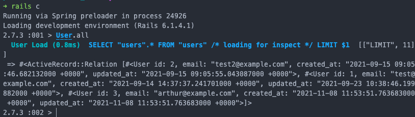
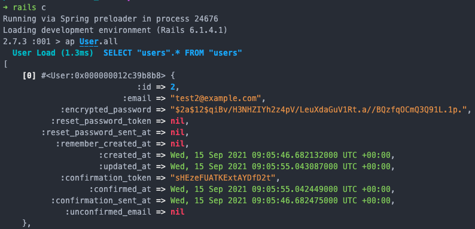

# :gem: My Favourite Gems :gem:

## [awesome-print](gems.md)

Soo helpful when doing stuff in irb and interacting with our objects from the database.

Looking at our list of users **without** the gem:



And **with** the gem:



## [devise](https://github.com/heartcombo/devise)

This gem does pretty much everything to do with authentication for you (including setting up DB and views) - I have a feeling that the coaches want us to do this from scratch though... but if you need to do it in future this is a must have.

## [simple-form](https://github.com/heartcombo/simple_form)

Makes creating forms in Rails a bit easier... 

Form **without** the gem:

```ruby
<%= form_for @user, :url => { :action => "create" } do |f| %>
  <label>username</label>
  <%= f.text_field :username %>
  <label>password</label>
  <%= f.select :password %>
  <%= f.submit "Submit" %>
<% end %>
```

and **with** the gem:
```ruby
<%= simple_form_for @user do |f| %>
  <%= f.input :username %>
  <%= f.input :password %>
  <%= f.button :submit %>
<% end %>
```

## [shoulda-matchers](https://github.com/thoughtbot/shoulda-matchers)

You guys may be familiar with this from previous projects, it extends the ways in which you can expect things in RSpec...

For example:
```ruby
RSpec.describe MenuItem, type: :model do
  describe 'associations' do
    it { should belong_to(:category).class_name('MenuCategory') }
  end

  describe 'validations' do
    it { should validate_presence_of(:name) }
    it { should validate_uniqueness_of(:name).scoped_to(:category_id) }
  end
end
```

## [acts-as-taggable-on](https://github.com/mbleigh/acts-as-taggable-on)

I first used this before we'd done tags in the Chitter challenge - it effectively has the same result but does a lot of the work for you.